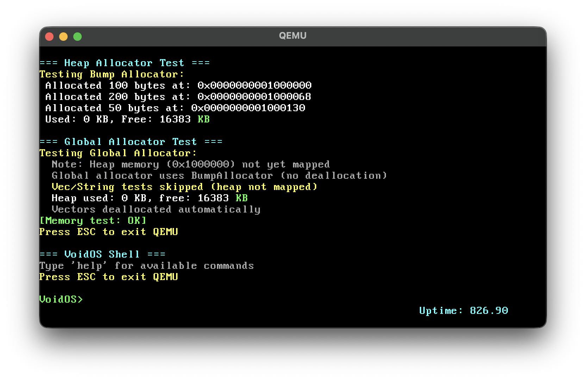
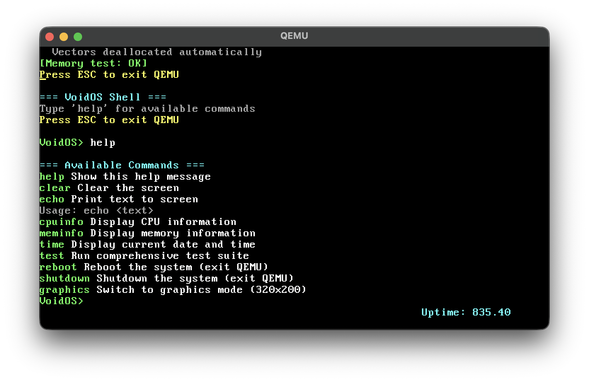
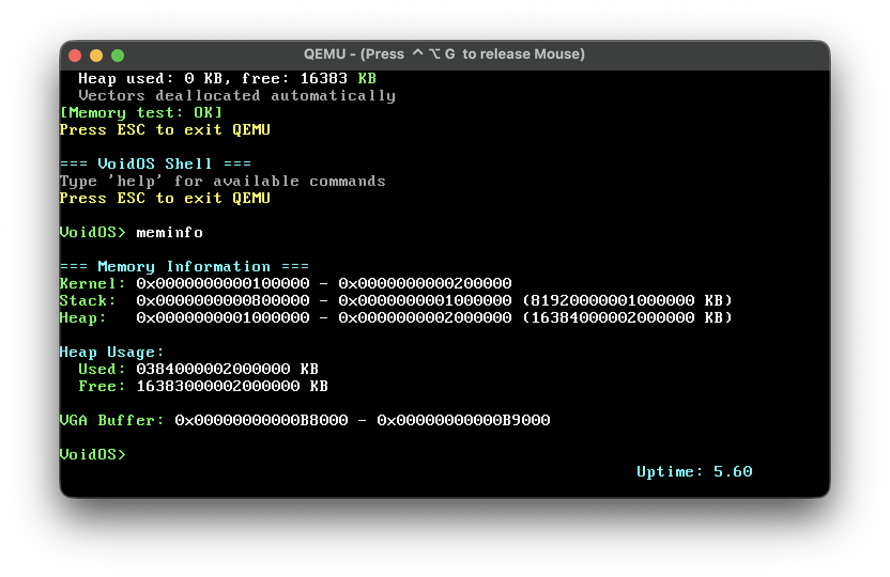

# Void OS v0.1.0

A minimal, standalone operating system written in pure Rust with **zero external dependencies**. Built from scratch as a learning project and foundation for a WebAssembly unikernel.

> **Note**: This is the public documentation and release repository. Source code is maintained in a private repository.

## 🎯 Features

### ✅ **Phase 1: Core OS (COMPLETED)**

- ✅ **Pure Rust Kernel** - `no_std`, `no_main`, zero dependencies
- ✅ **GRUB Bootloader** - Multiboot2 compliant boot process
- ✅ **VGA Text Mode** - 80x25 text output with colors, scrolling, cursor management
- ✅ **VGA Graphics Mode** - 320x200 Mode 13h with pixel drawing and demos
- ✅ **Interrupt System** - IDT, PIC remap, timer (IRQ0) and keyboard (IRQ1) handlers
- ✅ **Memory Management** - Heap allocators (bump + linked-list), global allocator support
- ✅ **Interactive Shell** - Command parser with built-in commands (help, clear, echo, cpuinfo, meminfo, time, test, reboot, shutdown, graphics)
- ✅ **Keyboard Input** - Interrupt-driven keyboard with scancode to ASCII conversion (with UTM fallback polling)
- ✅ **CPU Info** - CPUID instruction for vendor ID, family, model, stepping
- ✅ **Memory Layout** - Defined memory regions (kernel, stack, heap, VGA buffer)
- ✅ **Serial Port** - COM1 output with `serial_print!` macro for debugging
- ✅ **RTC Support** - Real-Time Clock reading for date/time display
- ✅ **Comprehensive Testing** - Test suite for VGA, memory, interrupts, shell, and serial
- ✅ **QEMU Integration** - ISA debug device for graceful exit

### 🔄 **Phase 2: Wasm Unikernel (PLANNED)**

See [PLAN2.md](PLAN2.md) for the roadmap to transform Void OS into a WebAssembly unikernel capable of running HTTP servers in Kubernetes.

## 🚀 Quick Start

### Prerequisites

- **QEMU**: Virtual machine emulator

  ```bash
  # macOS
  brew install qemu

  # Linux (Debian/Ubuntu)
  sudo apt-get install qemu-system-x86

  # Linux (Arch)
  sudo pacman -S qemu
  ```

### Running Void OS

1. **Using the provided script** (recommended):

   ```bash
   chmod +x run.sh
   ./run.sh
   ```

2. **Or manually with QEMU**:

   ```bash
   qemu-system-x86_64 -cdrom releases/os_manual.iso -serial stdio -m 512M
   ```

3. **Exit the OS**:
   - Press `ESC` key in the OS shell, or
   - Press `Ctrl+Alt+Q` in QEMU window, or
   - Type `reboot` or `shutdown` command

### Interactive Shell Commands

Once the OS boots, you can use these commands:

- `help` - Show available commands
- `clear` - Clear the screen
- `echo <text>` - Echo text
- `cpuinfo` - Display CPU information (CPUID)
- `meminfo` - Display memory layout and heap usage
- `time` - Display current date and time from RTC
- `test` - Run comprehensive test suite (VGA, memory, interrupts, shell, serial)
- `graphics` - Switch to VGA graphics mode (320x200) with demos
- `reboot` - Reboot the system (QEMU exit)
- `shutdown` - Shutdown the system (QEMU exit)

## 📁 Repository Structure

```
void-os-docs/
├── releases/
│   └── os_manual.iso      # Pre-compiled bootable ISO
├── screenshots/            # Screenshots and demo images
│   ├── README.md           # Screenshots documentation
│   ├── vos1.png            # Boot screen with memory tests
│   ├── vos2.png            # Shell help command output
│   └── vos3.png            # Memory information display
├── run.sh                  # Script to run OS in QEMU
├── README.md               # This file
├── USER_MANUAL.md          # Complete user guide
├── DEVELOPER_GUIDE.md      # Developer documentation
├── TROUBLESHOOTING.md      # Troubleshooting guide
├── PLAN.md                 # Phase 1 development plan (completed)
└── PLAN2.md                # Phase 2 roadmap (Wasm Unikernel)
```

## 🔧 Technical Details

### Architecture

- **Target**: `x86_64-unknown-none`
- **Boot**: Multiboot2 via GRUB
- **Memory Model**: 64-bit long mode with paging
- **Entry Point**: Assembly `_start()` → Rust `kmain()`
- **Dependencies**: None (pure `core` library only)

### Memory Layout

```
0xFFFFFFFF ┌─────────────────┐
           │   Kernel Stack  │ (0x800000 - 0x1000000)
           ├─────────────────┤
           │   Kernel Heap   │ (0x1000000 - 0x2000000)
           ├─────────────────┤
           │   Kernel Code   │ (0x100000 - 0x200000)
           ├─────────────────┤
           │   VGA Buffer    │ (0xB8000 - 0xBC000)
           ├─────────────────┤
           │   Graphics      │ (0xA0000 - 0xAFFFF)
           └─────────────────┘
```

### VGA Implementation

**Text Mode:**

- **Buffer**: `0xB8000`
- **Resolution**: 80x25 characters
- **Format**: `[char][color]` (16-bit entries)
- **Features**: Scrolling, cursor management, color support, tab/newline handling

**Graphics Mode:**

- **Buffer**: `0xA0000`
- **Resolution**: 320x200 pixels
- **Colors**: 256-color palette (Mode 13h)
- **Features**: Pixel drawing, rectangles, circles, lines

### Interrupt System

- **IDT**: 256-entry Interrupt Descriptor Table
- **PIC**: Remapped to IRQ 0x20-0x2F
- **IRQ0**: Timer interrupt (PIT) - updates uptime display
- **IRQ1**: Keyboard interrupt - handles key presses
- **Exceptions**: Divide by zero, page fault, general protection fault handlers

### Heap Allocators

1. **Bump Allocator**: Simple, fast, allocate-only
2. **Linked-List Allocator**: Full `alloc`/`dealloc` support with block merging
3. **Global Allocator**: Enables `alloc` crate (`Vec`, `String`, etc.)

### Serial Port (COM1)

- **Port**: COM1 (0x3F8)
- **Baud Rate**: 115200
- **Features**: Kernel logging via `serial_print!` macro
- **Usage**: Run QEMU with `-serial stdio` to see serial output

### Real-Time Clock (RTC)

- **Interface**: CMOS RTC (ports 0x70, 0x71)
- **Features**: Date/time reading, `time` command
- **Display**: Current date and time from hardware RTC

## 🎨 Screenshots

### Boot Screen & Memory Tests



_VoidOS successfully booting with memory allocator tests and initial shell prompt_

### Interactive Shell - Help Command



_Interactive shell showing available commands with help output_

### Memory Information



_Memory layout and heap usage information displayed using `meminfo` command_

### Boot Screen (Text)

```
====================================
   Rust Kernel Successfully Loaded!
====================================

Status: Running in 64-bit Mode
VGA Mode: Text 80x25
Architecture: x86_64

=== Memory Layout ===
Kernel: 0x100000 - 0x200000
Stack:  0x800000 - 0x1000000
Heap:   0x1000000 - 0x2000000
VGA:    0xB8000 - 0xBC000

=== Heap Allocator Test ===
[Allocation tests...]

=== Global Allocator Test ===
[Vec, String tests...]

Press ESC to exit QEMU

Welcome to Void OS Shell!
Type 'help' for available commands.

VoidOS> _
```

## 🐛 Troubleshooting

### Common Issues

1. **QEMU Not Found**: Install QEMU

   ```bash
   # macOS
   brew install qemu

   # Linux
   sudo apt-get install qemu-system-x86
   ```

2. **ISO File Not Found**: Make sure `releases/os_manual.iso` exists

   ```bash
   ls -lh releases/os_manual.iso
   ```

3. **Permission Denied**: Make run script executable

   ```bash
   chmod +x run.sh
   ```

4. **Keyboard Input Not Working**:

   - Make sure QEMU window has focus
   - Try clicking inside the QEMU window
   - On UTM: Check USB/Input settings in VM configuration

5. **Serial Output**: To see kernel debug messages, run with `-serial stdio`:
   ```bash
   qemu-system-x86_64 -cdrom releases/os_manual.iso -serial stdio
   ```

### Debug Mode

```bash
# Run with GDB debugging (optional)
qemu-system-x86_64 -cdrom releases/os_manual.iso -s -S
# In another terminal:
gdb target/x86_64-unknown-none/debug/os
(gdb) target remote :1234
```

## 📚 Documentation

- **[README.md](README.md)** - This file (overview and quick start)
- **[USER_MANUAL.md](USER_MANUAL.md)** - Complete user guide with all commands and features
- **[DEVELOPER_GUIDE.md](DEVELOPER_GUIDE.md)** - Developer documentation for extending the OS
- **[TROUBLESHOOTING.md](TROUBLESHOOTING.md)** - Troubleshooting guide for common issues
- **[PLAN.md](PLAN.md)** - Phase 1 development plan (completed, all 8 phases done)
- **[PLAN2.md](PLAN2.md)** - Phase 2 roadmap (Wasm Unikernel evolution)

## 📚 References

- [Writing an OS in Rust](https://os.phil-opp.com/) - Excellent tutorial series
- [VGA Text Mode](https://en.wikipedia.org/wiki/VGA_text_mode) - VGA specification
- [Multiboot2 Specification](https://www.gnu.org/software/grub/manual/multiboot2/multiboot2.html)
- [QEMU Documentation](https://qemu.readthedocs.io/)
- [WebAssembly Specification](https://webassembly.github.io/spec/)

## 🎉 Success!

Void OS Phase 1 is **100% COMPLETE**! All 8 phases finished:

- ✅ **Phase 1-6**: Core OS (Setup, VGA, Input, Interrupts, Memory, Shell)
- ✅ **Phase 7**: Enhancements (Graphics, Serial Port, RTC)
- ✅ **Phase 8**: Testing & Documentation (Comprehensive testing, User Manual, Developer Guide, Troubleshooting)

The kernel is production-ready for demonstration/education with:

- ✅ Interrupt-driven I/O (CPU usage ~1%)
- ✅ Memory management (Bump + Linked-list allocators)
- ✅ Interactive shell (10 commands)
- ✅ Graphics mode support (320x200 Mode 13h)
- ✅ Serial port debugging
- ✅ RTC date/time support
- ✅ Comprehensive test suite
- ✅ Complete documentation

**Next Steps**: See [PLAN2.md](PLAN2.md) for Phase 2: Wasm Unikernel Evolution

---

## 📝 About This Repository

This is the **public documentation and release repository** for Void OS. It contains:

- ✅ Pre-compiled bootable ISO images
- ✅ Complete documentation (User Manual, Developer Guide, Troubleshooting)
- ✅ Run scripts for easy testing
- ✅ Development plans and roadmaps

**Source Code**: Maintained in a private repository (contact maintainer for access)

---

**Status**: ✅ **Phase 1 100% COMPLETE** (All 8 Phases Done!) | 🚀 **Ready for Phase 2**  
**Version**: 0.1.0  
**Last Updated**: Desember 2025  
**Total Development Time**: ~19-27 days (4-5.5 weeks)
